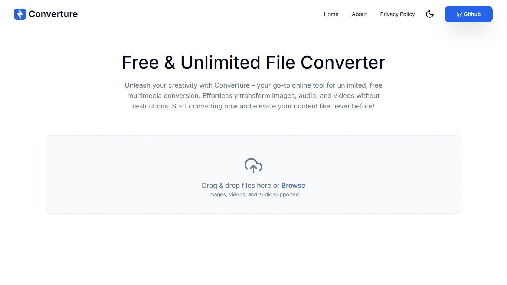
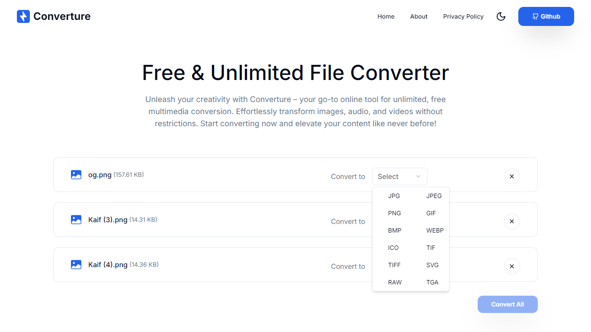
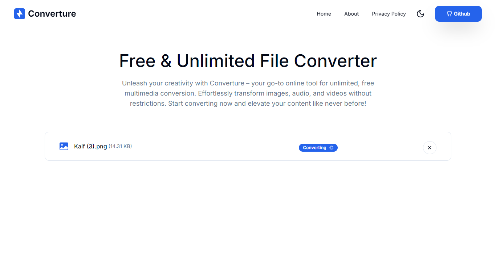
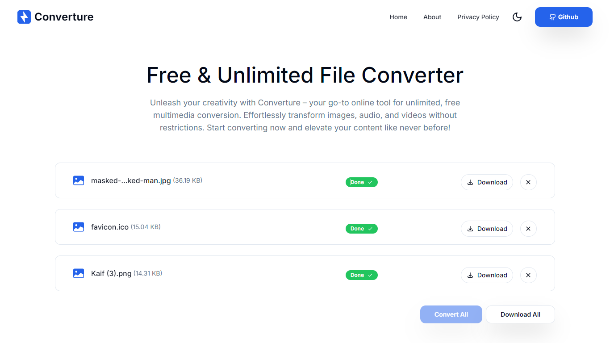
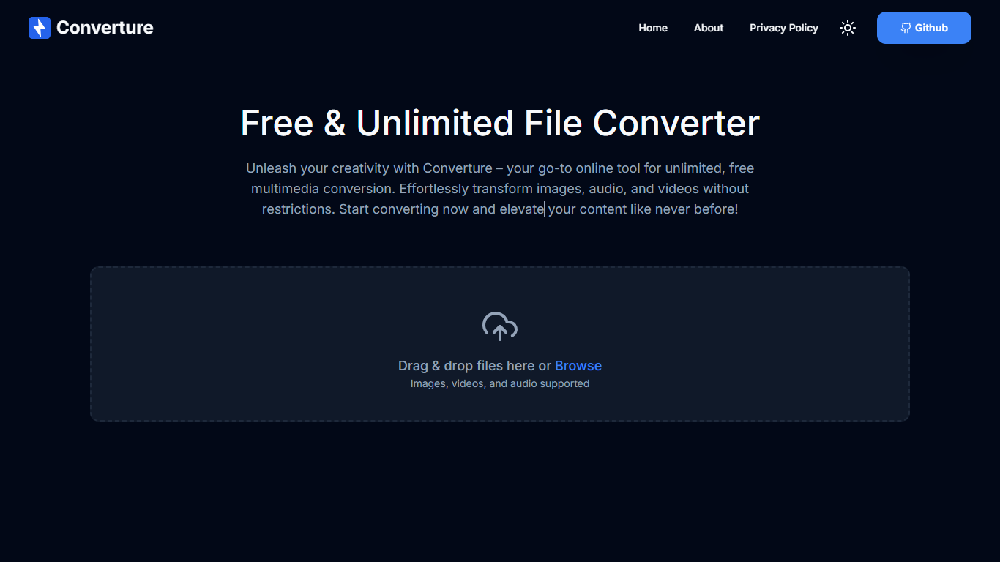
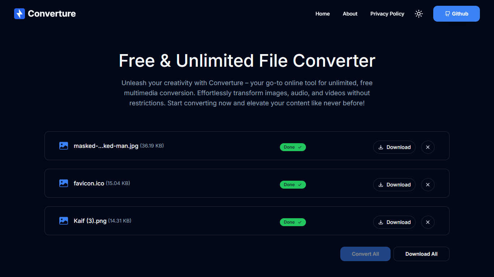

# Converture - Free & Unlimited File Converter 

---

Converture is a free and unlimited online multimedia file converter. Effortlessly transform images, audio, and videos to your desired formats. It's fast, reliable, and completely unrestricted.

## [Live Demo →](https://your-live-demo-link.com)

## Preview  



 

 

## Dark Mode

 

## Getting Started

To get started with Converture, follow these steps:

1. **Clone the repository:**

```bash
git clone https://github.com/yourusername/converture.git
```

2. **Install the dependencies:**

```bash
npm install
```

3. **Run the development server:**

```bash
npm run dev
```